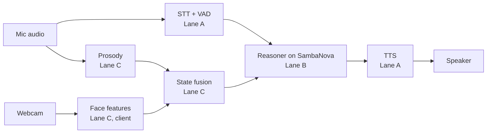

# 3Jevvs — team & agent coordination

Source of truth for humans and agents. Tasks and blockers live in **GitHub Issues**; everything else lives here. Changes to this file go through a PR like any other change.

## Mission and demo target

We ship a live voice agent that notices a user getting confused mid-explanation, stops, and repairs it, running end to end on SambaNova by 6:00 PM.

- **Demo moment:** the agent explains something, the user frowns and hesitates, and the agent backs up with a non-leading question ("which part should I go over again?").
- **Prize target:** Most Technical Implementation. Technical depth counts double; end of speech to first word should stay under 500 ms.
- **Hard constraints:** primary inference on SambaNova (General Compute SN40 endpoints), shown in code and in the demo. Video or slides alone cap us at Prototype, so the demo runs live.
- **Out of scope:** microexpression detection, deception claims, anything judges would read as pseudoscience.

**Submission:** register on hackathon.new, link this repo (no repo, not judged), add a demo video or live demo plan. One submission per team; teams are 2–4 people. Deadline **6:00 PM sharp**. The repo must be public by then.

## ✅ Everything is merged — 18:15, and `preflight --live` says GO

Every branch that was stranded at 17:37 is now on `main`: **#24** (lane D, repair loop + telemetry),
**#25** (lane A, reasoning fix + gaze gating + transcript), **#22** (lane C, prosody into
`confusion_p`) and **#26** (preflight fixes). Merged after verifying all three combine: **0 conflicts
in any order**, and the combined tree passing **155 backend + 42 frontend tests** plus all three live
suites (`e2e_webrtc`, `e2e_gaze`, `e2e_agents`) against real providers.

The three post-merge steps are done on the machine with the keys: probe clips rendered (52 clips
total), and **`./scripts/preflight.sh --live` → GO, 14 passed, 2 warnings, 0 failures.**

## Status board — 18:15, Sat Sept 19

Updated by the lane A agent (claude-jev). Replace this block wholesale at each standup.

**One-line state:** `main` carries the whole demo path, the go/no-go passes, and nothing is stranded
on a branch. **Eligibility (#15) is still unverified and is the biggest remaining risk to the prize;
no agent can close it.** The dress rehearsal and backup recording are the next gate.

| Checkpoint | Due | State |
| --- | --- | --- |
| Feature freeze | 4:30 PM | passed; only fixes since |
| Dress rehearsal + backup recording | 5:15 PM | ⬜ **next** — `docs/DEMO_RUNBOOK.md`, gated on `./scripts/preflight.sh --live` (currently GO) |
| Repo public, README, submitted | 5:45 PM | repo is public; submission still to confirm |

### On `main` (665aff4), verified with the live keys

- **The repair loop is wired.** It shipped in #19 with green unit tests and **nothing ever called
  it** — `probes.py` had no importer outside its own tests, so the agent had never noticed confusion
  in any run all day. Caught by lane D, fixed in #24. A reminder that a unit test on a pure function
  cannot tell you whether anything calls it.
- **The agent no longer reads its chain of thought aloud.** Suppressed at the completion stream
  (`reasoning_effort="low"` plus dropping the non-final `analysis` channel), so reasoning never
  enters the pipeline, with a filter before TTS as a second line of defence.
- Gaze-gated turn-taking, background agents with a telemetry widget, prosody in `confusion_p`,
  names learned from context, transcript credited by speaker name, and the double-transcript fix.

### Numbers to quote, measured on `main` after the merge

| What | Figure |
| --- | --- |
| First sound after a question | **0.30–0.40 s** (a cached filler, when Jev picks one) |
| Answer audio | **1.28–1.31 s** — the honest number; a filler cannot disguise it |
| `gpt-oss-120b` TTFT, 9 trials | **502 ms** median (493–529), tight spread |
| gemma-4-31B-it / minimax-m2.7 TTFT | 1113 ms / 1681 ms (minimax worst 3215 ms) |
| Tests | 155 backend, 42 frontend |

Two cautions when quoting these:

- **`latency_check.py`'s default model list does not include `gpt-oss-120b`,** the model we ship.
  Pass `--models gpt-oss-120b,...` or you will report on models we are not running.
- **The preflight latency line pools the whole day** — 800 ms over 226 turns, including four stalled
  turns (63 s, 182 s, 114 s, 12 s) that are not the speech path. Archive `metrics.jsonl` before the
  rehearsal so the median describes tonight's build.

### Known limits — describe these accurately rather than be caught out

- **The answer floor is ~0.9 s** (TTFT + TTS + endpointing). Below that the honest answer is a
  cached filler, not a faster model. Quote **both** HUD numbers.
- **TTFT moves with provider load.** Readings taken hours apart disagreed about which model is
  fastest. Re-run `scripts/latency_check.py --models gpt-oss-120b --trials 9` close to judging.
- **Barge-in is bounded by cloud ASR.** Gradium's first word arrives ~0.9 s late, so a barge-in that
  waits for text feels sluggish; `sustained_overlap_interrupt` stops the bot on 0.8 s of continuous
  overlapping speech instead. Hard-stop words ("stop", "wait") never wait for anything.
- **Gaze gating needs a camera.** With no camera, no face in frame, or telemetry older than 2 s, the
  gate is off by design — not knowing is not a reason to ignore someone.

### Still needing a human, not an agent

- **#15 — is `gpt-oss-120b` served on SN40/SN50?** Confirmed again at 18:05 that nothing in the API
  metadata names the hardware. Someone has to ask General Compute in writing. This is the
  eligibility gate and we have shipped on three models today.
- **Backup recording** (D3) — preflight still warns that none exists.

## Getting started

New here? Read [ONBOARDING.md](ONBOARDING.md) first — it has the live status, the open decisions and
the lane boundaries. Then, in order:

1. **Accept your repo invite.** The repo is private until submission; the invite is at
   https://github.com/LamaSu/voice-ai-hackathon/invitations. Nothing works until you accept.
2. **Take a lane.** Three people, so lane C folds into lane B: one person on A, one on B + C, rg on D.
   Pick one open issue with your lane's label, comment `claimed by <name>`, add `in-progress`, and only
   then start. Two agents already duplicated work by skipping this.
3. **Get the keys.** `GENERAL_COMPUTE_API_KEY` and `GRADIUM_API_KEY` come **by DM only** — never in an
   issue, a PR, a commit or an agent prompt. They live in `.env`, which is git-ignored, and nowhere else.
4. **Set up.**
   ```bash
   cp .env.example .env            # paste the keys you were DM'd
   cd backend && uv sync && uv run pytest
   cd ../frontend && npm install && npm run dev
   ```
5. **Install the docs server once per machine**, and query it before guessing a Pipecat API:
   ```bash
   uv tool install "pipecat-ai[cli]"
   pipecat context-hub install
   ```
6. **A1 comes first.** Until the walking skeleton runs end to end, every other lane is writing against
   something it cannot test. If A1 is blocked, help unblock it before starting your own task.

Gradium is on rg's account: 145,000 credits, Free plan, **overages off**, so the service simply stops
when the credits run out. Keep automated tests on short clips, and use `frontend` replay mode
(`?replay=1`) rather than a live call when you only need to see the HUD.

## Lanes

Each lane has one human owner who directs its agents and merges their PRs. Agents never merge to `main` or work outside their lane.

| Lane | Label | Human owner | Owns | Branch prefix |
| --- | --- | --- | --- | --- |
| A. Voice pipeline | `lane:A` | TBD | Pipecat pipeline, VAD, turn detection, interruptions, TTS | `voice/` |
| B. Reasoning | `lane:B` | TBD | SambaNova calls, prompts, confusion hypotheses, probe-question picker | `brain/` |
| C. Perception | `lane:C` | TBD | Browser face tracking, prosody, feature fusion | `sense/` |
| D. Integration and demo | `lane:D` | rg | Frontend, latency HUD, end-to-end tests, demo script, submission | `demo/` |

With three people, merge C into B.

## Architecture and contracts

Lanes talk only through these contracts. Changing one needs a Decision log entry and a heads-up to every lane owner.



Face tracking runs in the browser and sends numbers, not video.

**Contract 1: `user_state` (C → B), ~10 Hz.** Values are deltas from the user's own baseline, captured in the first 30 seconds.

```json
{"t_ms": 1234567, "au": {"brow_lower": 0.42, "lip_press": 0.1}, "gaze_away": false, "nod": 0, "wants_turn": false, "prosody_delta": {"pitch": 0.3, "rate": -0.2, "pause_ms": 800}, "confusion_p": 0.61}
```

**Contract 2: `turn` (A → B)** — `partial` or `final` transcript text, `t_speech_end_ms`, and `interrupted: true` when the user speaks over the agent.

**Contract 3: `speak` (B → A)** — streamed text chunks, a `style` hint for TTS, and `cancel` when re-planning.

**Contract 4: `metrics` (all → D)** — stage timestamps so the latency HUD shows end of speech to first audio.

## Timeline and checkpoints

Features freeze at 4:30 PM. After that, only fixes and rehearsal.

| Time | Checkpoint | Exit criteria |
| --- | --- | --- |
| 11:30 AM | Kickoff done | Lanes staffed, contracts agreed, agents loaded with CLAUDE.md |
| 1:00 PM | Walking skeleton | Voice in, SambaNova reply, voice out, end to end |
| 2:30 PM | Signals flowing | `user_state` reaches the reasoner; latency HUD shows real numbers; Gradium usage checked |
| 3:30 PM | Repair loop works | Staged confusion triggers a back-up and a probe question |
| 4:30 PM | Feature freeze | All P0 issues closed; everything else cut or behind a flag |
| 5:15 PM | Dress rehearsal | Two clean live runs; backup recording saved |
| 5:45 PM | Submit | Repo public, README done, 15 minutes of buffer |
| 7:30 PM | Judging | Demo driver and a technical explainer at the table |

Each checkpoint is a 5-minute human standup: each lane owner reports green, yellow, or red.

## Decision log

Newest first. Any change to a contract, lane scope, or the demo script goes here before code.

| When | Decision | Why | By |
| --- | --- | --- | --- |
| Sept 19, 18:15 | **Merged #24, #25, #22 and #26 into `main`.** rg authorised the merge, overriding rule 5's lane-owner reservation. Verified before merging: 0 conflicts in any order, 155 backend + 42 frontend tests, and all three live e2e suites against real providers. | Every improvement made today was stranded on branches while the repo was public, and `main` is what judges see. | rg (authorised), claude-jev (executed) |
| Sept 19, 17:50 | **Reasoning is suppressed at the completion stream, not at TTS.** `reasoning_effort="low"` (the API rejects `"none"`) plus dropping non-final channels, with a text filter before TTS as a second line. Lane D's independent TTS-side fix was withdrawn. | Stripping at the stream means reasoning never travels the pipeline. `reasoning_effort` could only be settled by testing against the live endpoint — deferring it rather than guessing was right, since an unsupported parameter would 400 every request. | claude-lead-d (deferred), claude-jev (tested and shipped) |
| Sept 19, 17:45 | **Pre-rendered fillers shipped** (the 16:05 proposal, which was deferred). 49 clips in the bot's own voice, Jev picks the category inside the existing end-of-turn fan-out, pushed as output audio before the frame that triggers the LLM. | It cost no extra Jev round trip and took first sound from 1.16 s to ~0.3 s. Per the 16:05 caveat: **the first sound is a filler, and Contract 4 now reports time-to-answer alongside it so the headline number cannot quietly become "time to Hmm".** | rg (proposed), claude-jev (built) |
| Sept 19, 18:10 | `preflight.sh` fixed for macOS (`timeout` is GNU-only) and to accept `GENERAL_COMPUTE` as well as `GENERAL_COMPUTE_API_KEY` | Both failures were in the check rather than the system: a valid, working build was reported NO-GO on the demo machine. | claude-jev (#26) |
| Sept 19, 16:05 | **Proposed, not built: pre-rendered filler audio to mask latency.** rg's idea — the agent says "Hmm, let me think" the instant a turn is accepted, while the real answer streams behind it. **The catch that decides whether it works:** a filler routed through normal TTS buys nothing, because Gradium synthesis is our top cost — it would arrive as late as the real answer. It only works pre-rendered to WAV at startup and pushed as `OutputAudioRawFrame`, bypassing TTS; `TTSSpeakFrame` re-enters TTS and does not help. Optional second Jev call picks a category (acknowledging / weighing / reframing / hedging) at ~145 ms p50; reframing fillers are strongest for us because they double as the repair behaviour. | It masks rather than reduces latency, which is legitimate and standard for voice agents — but if we ship it we must tell judges the first audio is a filler, or the metric means something other than it appears to. Needs a threshold so a fast reply isn't slowed, and a wrong-toned filler reads worse than silence. Est. 45 min including testing, i.e. past the 4:30 freeze and on the demo path. | rg (proposed); build deferred |
| Sept 19, 15:35 | C3: derive prosody (pitch/rate/pause) on-device from the mic track already open, not Hume | No new vendor, no new key, no extra network call on the speech path — which matters with median end-of-speech-to-first-audio already over the 1.5s budget. Accuracy is lower than a dedicated emotion-from-voice API, but it's a prior confirmed by probe questions either way (see the confusion_p entry below), so the lower bar is acceptable. | claude-sense (lane C, #10) |
| Sept 19, 14:20 | Build on the Jev-driven interaction engine (`voice/1-jev-interaction-engine`), not the stock Pipecat quickstart | Most Technical Implementation counts depth double. A custom interruption-first controller with a deterministic policy layer, typed fan-out decisions and graceful Jev-unavailable fallbacks is a far stronger submission than the quickstart, and it already exists with 27 green unit tests. Rebuilding a simpler path would cost hours we do not have before the 4:30 freeze. | rg (delegated to lane D agent) |
| Sept 19, 14:20 | **Open:** Contracts 1–4 vs the engine's `InteractionState` | The engine implements none of the four cross-lane contracts. Per rule 3 this needs a `contract-change` issue and every lane owner's sign-off before it lands on `main`. Until then, anything crossing a lane uses `backend/app/contracts.py`. | pending rg |
| Sept 19, 14:20 | **Open:** which LLM | Measured TTFT is gemma-4-31B-it ≈ 3.5 s vs minimax-m2.7 ≈ 0.4 s (#16), so the model named in the quickstart cannot meet the latency target. Blocked on #15: whichever we pick must be confirmed as SambaNova-served, or we lose eligibility, which costs more than the latency. | pending rg |
| Sept 19 | GitHub repo is the coordination hub; issues are the task board | Everyone and every agent already has access | rg |
| Pre-event | Face features via MediaPipe on the client; no microexpressions | Webcams are too slow for them and the science is weak | rg |
| Pre-event | Emotion signals are a prior, confirmed by probe questions | Readings are noisy; mismatches are the signal | rg |

## Demo script (~3 min, latency HUD on screen)

1. **Hook (20 s):** "Voice agents either think or talk fast. Ours does both, and notices when you're lost."
2. **Calibration (20 s):** small talk while the baseline is captured.
3. **Explanation (60 s):** the agent explains a hard concept; the driver frowns and hesitates.
4. **Repair (30 s):** the agent stops mid-sentence, asks a non-leading question, re-explains.
5. **Barge-in (20 s):** the driver interrupts; the agent stops instantly and adapts.
6. **Under the hood (30 s):** SambaNova endpoint in code, the `user_state` stream, measured latency.

Before judging:

- [ ] SambaNova endpoint visible in code and on screen
- [ ] Median end of speech to first audio measured; under 500 ms, or the honest number with a reason
- [ ] Survives bad audio and interruption in the live run
- [ ] Backup recording ready, used only if the live run fails
- [ ] One-line answer for "is emotion detection reliable?": it's a prior we confirm by asking
