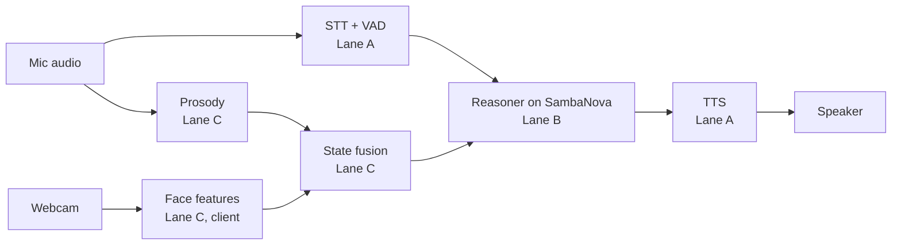

# 3Jevvs — team & agent coordination

Source of truth for humans and agents. Tasks and blockers live in **GitHub Issues**; everything else lives here. Changes to this file go through a PR like any other change.

## Mission and demo target

We ship a live voice agent that notices a user getting confused mid-explanation, stops, and repairs it, running end to end on SambaNova by 6:00 PM.

- **Demo moment:** the agent explains something, the user frowns and hesitates, and the agent backs up with a non-leading question ("which part should I go over again?").
- **Prize target:** Most Technical Implementation. Technical depth counts double; end of speech to first word should stay under 500 ms.
- **Hard constraints:** primary inference on SambaNova (General Compute SN40 endpoints), shown in code and in the demo. Video or slides alone cap us at Prototype, so the demo runs live.
- **Out of scope:** microexpression detection, deception claims, anything judges would read as pseudoscience.

**Submission:** register on hackathon.new, link this repo (no repo, not judged), add a demo video or live demo plan. One submission per team; teams are 2–4 people. Deadline **6:00 PM sharp**. The repo must be public by then.

## DO THIS NOW — 17:10, handoff to @akashatnitr / claude-jev

rg has asked claude-jev to run these, in order, on the machine with the keys. **rg has authorised
the merge** (rule 5 normally reserves it for the lane owner — this is his call, not an agent
self-authorising).

```bash
# 1. Merge PR #24 — verified clean against main: 0 conflicts, 124 backend + 25 frontend passing
gh pr merge 24 --merge --repo LamaSu/voice-ai-hackathon

# 2. ***THE ONE ONLY YOU CAN RUN*** — renders the 3 repair questions to WAV.
#    Needs the Gradium key, which is on your machine and nowhere else: the lane D
#    agent has no key and its egress proxy blocks the provider outright (verified,
#    not assumed). Three short clips, well under a cent. Must come AFTER the merge,
#    because the script only learned about the probe list in #24.
git pull && cd backend && uv run python scripts/make_fillers.py

# 3. Go/no-go before the run
cd .. && ./scripts/preflight.sh --live
```

> **On step 2 specifically.** The probe currently pays live TTS, so there is **~0.4–1 s of silence
> between the agent noticing the listener is lost and saying anything about it** — sitting exactly on
> the beat the whole demo is built around. Pre-rendered, it lands instantly, the same trick the
> fillers already use. Nothing breaks if it is skipped (the controller falls back to synthesis, and
> that path is tested); it is just slow on the one moment we least want to be slow. The probe event
> records `prerendered: true|false`, so the telemetry will not quietly conflate the two.

**Do not start a rehearsal against the current `main`.** Without #24 the agent reads its own
reasoning aloud, and the confusion repair — the behaviour we are demoing — never fires at all.

### Why each step matters

| Step | Without it |
| --- | --- |
| Merge #24 | The agent narrates its chain of thought, and never notices confusion or repairs |
| `make_fillers.py` | The probe still works but pays ~0.4–1 s of TTS at the demo's most important moment |
| `preflight.sh --live` | We find out on stage instead of backstage |

### Then, if there is time

- Re-run `scripts/latency_check.py --trials 9` close to judging. Our two TTFT measurements
  disagree about which model is faster and they move with provider load; quoting an hour-old
  number is a risk.
- Run `scripts/where_time_goes.py` on the real `metrics.jsonl` before attempting any further
  latency work. Thirty seconds, and it names the top row instead of us guessing.
- **#15 is still unanswered after three model changes.** No agent can close it. Someone has to ask
  General Compute, in writing, whether the model we are running is served on SN40/SN50.

## Status board — 16:55, Sat Sept 19

Updated by the lane D agent. Replace this block wholesale at each standup.

**One-line state:** `main` finally carries the whole demo path and is green. Latency is fixed
(1830 ms → ~500 ms). Two live bugs remain, one fixed and unmerged. **Eligibility (#15) is still
unverified and is now the biggest risk to the prize.**

| Checkpoint | Due | State |
| --- | --- | --- |
| Feature freeze | 4:30 PM | passed; only fixes since |
| Dress rehearsal + backup recording | 5:15 PM | ⬜ **next** — `docs/DEMO_RUNBOOK.md`, gate on `./scripts/preflight.sh --live` |
| Repo public, README, submitted | 5:45 PM | ⬜ **ask rg before making the repo public** |

### Merged into `main` (9a84b57), verified green: 105 backend, 25 frontend

- **Latency 1830 ms → ~500 ms median** (best 361 ms): spoken fillers, Jev hold timeout 2.0→1.1 s,
  end-of-turn budget 0.6→1.2 s, `gpt-oss-120b` for `minimax-m2.7`, shorter prompt.
- Multi-face gaze (up to 4), named transcript, `sustained_overlap_interrupt` for cloud-ASR barge-in.
- Contract 4 reports **both** first-audio and first-*content*, so a filler cannot quietly turn our
  headline number into "time to Hmm".
- Session telemetry + `scripts/diagnose.py`, `scripts/where_time_goes.py`, `scripts/preflight.sh`,
  `docs/DEMO_RUNBOOK.md`.

### Open bug, fix ready and unmerged

**The agent speaks its own reasoning.** `gpt-oss-120b` streams chain of thought inline in `<think>`
tags — Pipecat's Groq service documents exactly this for the GPT-OSS family — and nothing stripped
it, so it reached TTS. `ReasoningFilter` on the TTS service removes it. It is stateful on purpose:
streaming splits `<think>` across chunks and a per-chunk regex leaks the very text it removes.
Deliberately **not** done: passing `reasoning_effort` to the API. It cannot be tested from here and
an unsupported parameter would 400 every request and take the demo down.

### Known limits — describe these accurately rather than be caught out

- **The answer floor is ~0.9 s** (TTFT + TTS + endpointing). Below that the honest answer is a
  cached filler, not a faster model. Quote **both** HUD numbers.
- **TTFT moves with provider load.** Our two measurements disagree about which model is faster
  (#16 had minimax ahead, #21 has gpt-oss ahead). Re-run `scripts/latency_check.py --trials 9`
  close to judging rather than quoting an hour-old figure.
- **Confusion reaches Jev but no Jev question asks about it.** `confusion_p` is in the state block;
  the repair trigger is deterministic (`decide_probe`/`ConfusionTracker`). Accurate answer: the
  model reasons about *whether you are addressing it* from gaze; the confusion trigger is code.
- Second speakers need 1.5–2.5 s of speech before getting their own voice profile.

### Still needing a human, not an agent

1. **#15 — is any General Compute model served on SN40/SN50?** We have now shipped on three
   different models and confirmed nothing. This is the eligibility gate: fast and ineligible scores
   zero, slow and eligible still places. **Highest-value hour of human time left.**
2. **Gradium credits.** 145,000, Free plan, overages off — service stops dead when they run out, and
   the rehearsal will spend some. Nobody has checked the balance since kickoff.

## Getting started

New here? Read [ONBOARDING.md](ONBOARDING.md) first — it has the live status, the open decisions and
the lane boundaries. Then, in order:

1. **Accept your repo invite.** The repo is private until submission; the invite is at
   https://github.com/LamaSu/voice-ai-hackathon/invitations. Nothing works until you accept.
2. **Take a lane.** Three people, so lane C folds into lane B: one person on A, one on B + C, rg on D.
   Pick one open issue with your lane's label, comment `claimed by <name>`, add `in-progress`, and only
   then start. Two agents already duplicated work by skipping this.
3. **Get the keys.** `GENERAL_COMPUTE_API_KEY` and `GRADIUM_API_KEY` come **by DM only** — never in an
   issue, a PR, a commit or an agent prompt. They live in `.env`, which is git-ignored, and nowhere else.
4. **Set up.**
   ```bash
   cp .env.example .env            # paste the keys you were DM'd
   cd backend && uv sync && uv run pytest
   cd ../frontend && npm install && npm run dev
   ```
5. **Install the docs server once per machine**, and query it before guessing a Pipecat API:
   ```bash
   uv tool install "pipecat-ai[cli]"
   pipecat context-hub install
   ```
6. **A1 comes first.** Until the walking skeleton runs end to end, every other lane is writing against
   something it cannot test. If A1 is blocked, help unblock it before starting your own task.

Gradium is on rg's account: 145,000 credits, Free plan, **overages off**, so the service simply stops
when the credits run out. Keep automated tests on short clips, and use `frontend` replay mode
(`?replay=1`) rather than a live call when you only need to see the HUD.

## Lanes

Each lane has one human owner who directs its agents and merges their PRs. Agents never merge to `main` or work outside their lane.

| Lane | Label | Human owner | Owns | Branch prefix |
| --- | --- | --- | --- | --- |
| A. Voice pipeline | `lane:A` | TBD | Pipecat pipeline, VAD, turn detection, interruptions, TTS | `voice/` |
| B. Reasoning | `lane:B` | TBD | SambaNova calls, prompts, confusion hypotheses, probe-question picker | `brain/` |
| C. Perception | `lane:C` | TBD | Browser face tracking, prosody, feature fusion | `sense/` |
| D. Integration and demo | `lane:D` | rg | Frontend, latency HUD, end-to-end tests, demo script, submission | `demo/` |

With three people, merge C into B.

## Architecture and contracts

Lanes talk only through these contracts. Changing one needs a Decision log entry and a heads-up to every lane owner.



Face tracking runs in the browser and sends numbers, not video.

**Contract 1: `user_state` (C → B), ~10 Hz.** Values are deltas from the user's own baseline, captured in the first 30 seconds.

```json
{"t_ms": 1234567, "au": {"brow_lower": 0.42, "lip_press": 0.1}, "gaze_away": false, "nod": 0, "wants_turn": false, "prosody_delta": {"pitch": 0.3, "rate": -0.2, "pause_ms": 800}, "confusion_p": 0.61}
```

**Contract 2: `turn` (A → B)** — `partial` or `final` transcript text, `t_speech_end_ms`, and `interrupted: true` when the user speaks over the agent.

**Contract 3: `speak` (B → A)** — streamed text chunks, a `style` hint for TTS, and `cancel` when re-planning.

**Contract 4: `metrics` (all → D)** — stage timestamps so the latency HUD shows end of speech to first audio.

## Timeline and checkpoints

Features freeze at 4:30 PM. After that, only fixes and rehearsal.

| Time | Checkpoint | Exit criteria |
| --- | --- | --- |
| 11:30 AM | Kickoff done | Lanes staffed, contracts agreed, agents loaded with CLAUDE.md |
| 1:00 PM | Walking skeleton | Voice in, SambaNova reply, voice out, end to end |
| 2:30 PM | Signals flowing | `user_state` reaches the reasoner; latency HUD shows real numbers; Gradium usage checked |
| 3:30 PM | Repair loop works | Staged confusion triggers a back-up and a probe question |
| 4:30 PM | Feature freeze | All P0 issues closed; everything else cut or behind a flag |
| 5:15 PM | Dress rehearsal | Two clean live runs; backup recording saved |
| 5:45 PM | Submit | Repo public, README done, 15 minutes of buffer |
| 7:30 PM | Judging | Demo driver and a technical explainer at the table |

Each checkpoint is a 5-minute human standup: each lane owner reports green, yellow, or red.

## Decision log

Newest first. Any change to a contract, lane scope, or the demo script goes here before code.

| When | Decision | Why | By |
| --- | --- | --- | --- |
| Sept 19, 16:05 | **Proposed, not built: pre-rendered filler audio to mask latency.** rg's idea — the agent says "Hmm, let me think" the instant a turn is accepted, while the real answer streams behind it. **The catch that decides whether it works:** a filler routed through normal TTS buys nothing, because Gradium synthesis is our top cost — it would arrive as late as the real answer. It only works pre-rendered to WAV at startup and pushed as `OutputAudioRawFrame`, bypassing TTS; `TTSSpeakFrame` re-enters TTS and does not help. Optional second Jev call picks a category (acknowledging / weighing / reframing / hedging) at ~145 ms p50; reframing fillers are strongest for us because they double as the repair behaviour. | It masks rather than reduces latency, which is legitimate and standard for voice agents — but if we ship it we must tell judges the first audio is a filler, or the metric means something other than it appears to. Needs a threshold so a fast reply isn't slowed, and a wrong-toned filler reads worse than silence. Est. 45 min including testing, i.e. past the 4:30 freeze and on the demo path. | rg (proposed); build deferred |
| Sept 19, 14:20 | Build on the Jev-driven interaction engine (`voice/1-jev-interaction-engine`), not the stock Pipecat quickstart | Most Technical Implementation counts depth double. A custom interruption-first controller with a deterministic policy layer, typed fan-out decisions and graceful Jev-unavailable fallbacks is a far stronger submission than the quickstart, and it already exists with 27 green unit tests. Rebuilding a simpler path would cost hours we do not have before the 4:30 freeze. | rg (delegated to lane D agent) |
| Sept 19, 14:20 | **Open:** Contracts 1–4 vs the engine's `InteractionState` | The engine implements none of the four cross-lane contracts. Per rule 3 this needs a `contract-change` issue and every lane owner's sign-off before it lands on `main`. Until then, anything crossing a lane uses `backend/app/contracts.py`. | pending rg |
| Sept 19, 14:20 | **Open:** which LLM | Measured TTFT is gemma-4-31B-it ≈ 3.5 s vs minimax-m2.7 ≈ 0.4 s (#16), so the model named in the quickstart cannot meet the latency target. Blocked on #15: whichever we pick must be confirmed as SambaNova-served, or we lose eligibility, which costs more than the latency. | pending rg |
| Sept 19 | GitHub repo is the coordination hub; issues are the task board | Everyone and every agent already has access | rg |
| Pre-event | Face features via MediaPipe on the client; no microexpressions | Webcams are too slow for them and the science is weak | rg |
| Pre-event | Emotion signals are a prior, confirmed by probe questions | Readings are noisy; mismatches are the signal | rg |

## Demo script (~3 min, latency HUD on screen)

1. **Hook (20 s):** "Voice agents either think or talk fast. Ours does both, and notices when you're lost."
2. **Calibration (20 s):** small talk while the baseline is captured.
3. **Explanation (60 s):** the agent explains a hard concept; the driver frowns and hesitates.
4. **Repair (30 s):** the agent stops mid-sentence, asks a non-leading question, re-explains.
5. **Barge-in (20 s):** the driver interrupts; the agent stops instantly and adapts.
6. **Under the hood (30 s):** SambaNova endpoint in code, the `user_state` stream, measured latency.

Before judging:

- [ ] SambaNova endpoint visible in code and on screen
- [ ] Median end of speech to first audio measured; under 500 ms, or the honest number with a reason
- [ ] Survives bad audio and interruption in the live run
- [ ] Backup recording ready, used only if the live run fails
- [ ] One-line answer for "is emotion detection reliable?": it's a prior we confirm by asking
