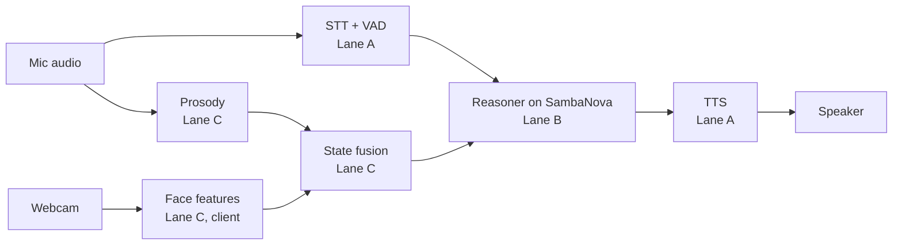

# Team & Agent Coordination

Source of truth for humans and agents. Tasks and blockers live in **GitHub Issues**; everything else lives here. Changes to this file go through a PR like any other change.

## Mission and demo target

We ship a live voice agent that notices a user getting confused mid-explanation, stops, and repairs it, running end to end on SambaNova by 6:00 PM.

- **Demo moment:** the agent explains something, the user frowns and hesitates, and the agent backs up with a non-leading question ("which part should I go over again?").
- **Prize target:** Most Technical Implementation. Technical depth counts double; end of speech to first word should stay under 500 ms.
- **Hard constraints:** primary inference on SambaNova (General Compute SN40 endpoints), shown in code and in the demo. Video or slides alone cap us at Prototype, so the demo runs live.
- **Out of scope:** microexpression detection, deception claims, anything judges would read as pseudoscience.

**Submission:** register on hackathon.new, link this repo (no repo, not judged), add a demo video or live demo plan. One submission per team; teams are 2–4 people. Deadline **6:00 PM sharp**. The repo must be public by then.

## Lanes

Each lane has one human owner who directs its agents and merges their PRs. Agents never merge to `main` or work outside their lane.

| Lane | Label | Human owner | Owns | Branch prefix |
| --- | --- | --- | --- | --- |
| A. Voice pipeline | `lane:A` | TBD | Pipecat pipeline, VAD, turn detection, interruptions, TTS | `voice/` |
| B. Reasoning | `lane:B` | TBD | SambaNova calls, prompts, confusion hypotheses, probe-question picker | `brain/` |
| C. Perception | `lane:C` | TBD | Browser face tracking, prosody, feature fusion | `sense/` |
| D. Integration and demo | `lane:D` | rg | Frontend, latency HUD, end-to-end tests, demo script, submission | `demo/` |

With three people, merge C into B.

## Architecture and contracts

Lanes talk only through these contracts. Changing one needs a Decision log entry and a heads-up to every lane owner.



Face tracking runs in the browser and sends numbers, not video.

**Contract 1: `user_state` (C → B), ~10 Hz.** Values are deltas from the user's own baseline, captured in the first 30 seconds.

```json
{"t_ms": 1234567, "au": {"brow_lower": 0.42, "lip_press": 0.1}, "gaze_away": false, "nod": 0, "wants_turn": false, "prosody_delta": {"pitch": 0.3, "rate": -0.2, "pause_ms": 800}, "confusion_p": 0.61}
```

**Contract 2: `turn` (A → B)** — `partial` or `final` transcript text, `t_speech_end_ms`, and `interrupted: true` when the user speaks over the agent.

**Contract 3: `speak` (B → A)** — streamed text chunks, a `style` hint for TTS, and `cancel` when re-planning.

**Contract 4: `metrics` (all → D)** — stage timestamps so the latency HUD shows end of speech to first audio.

## Timeline and checkpoints

Features freeze at 4:30 PM. After that, only fixes and rehearsal.

| Time | Checkpoint | Exit criteria |
| --- | --- | --- |
| 11:30 AM | Kickoff done | Lanes staffed, contracts agreed, agents loaded with CLAUDE.md |
| 1:00 PM | Walking skeleton | Voice in, SambaNova reply, voice out, end to end |
| 2:30 PM | Signals flowing | `user_state` reaches the reasoner; latency HUD shows real numbers; Gradium usage checked |
| 3:30 PM | Repair loop works | Staged confusion triggers a back-up and a probe question |
| 4:30 PM | Feature freeze | All P0 issues closed; everything else cut or behind a flag |
| 5:15 PM | Dress rehearsal | Two clean live runs; backup recording saved |
| 5:45 PM | Submit | Repo public, README done, 15 minutes of buffer |
| 7:30 PM | Judging | Demo driver and a technical explainer at the table |

Each checkpoint is a 5-minute human standup: each lane owner reports green, yellow, or red.

## Decision log

Newest first. Any change to a contract, lane scope, or the demo script goes here before code.

| When | Decision | Why | By |
| --- | --- | --- | --- |
| Sept 19 | GitHub repo is the coordination hub; issues are the task board | Everyone and every agent already has access | rg |
| Pre-event | Face features via MediaPipe on the client; no microexpressions | Webcams are too slow for them and the science is weak | rg |
| Pre-event | Emotion signals are a prior, confirmed by probe questions | Readings are noisy; mismatches are the signal | rg |

## Demo script (~3 min, latency HUD on screen)

1. **Hook (20 s):** "Voice agents either think or talk fast. Ours does both, and notices when you're lost."
2. **Calibration (20 s):** small talk while the baseline is captured.
3. **Explanation (60 s):** the agent explains a hard concept; the driver frowns and hesitates.
4. **Repair (30 s):** the agent stops mid-sentence, asks a non-leading question, re-explains.
5. **Barge-in (20 s):** the driver interrupts; the agent stops instantly and adapts.
6. **Under the hood (30 s):** SambaNova endpoint in code, the `user_state` stream, measured latency.

Before judging:

- [ ] SambaNova endpoint visible in code and on screen
- [ ] Median end of speech to first audio measured; under 500 ms, or the honest number with a reason
- [ ] Survives bad audio and interruption in the live run
- [ ] Backup recording ready, used only if the live run fails
- [ ] One-line answer for "is emotion detection reliable?": it's a prior we confirm by asking
